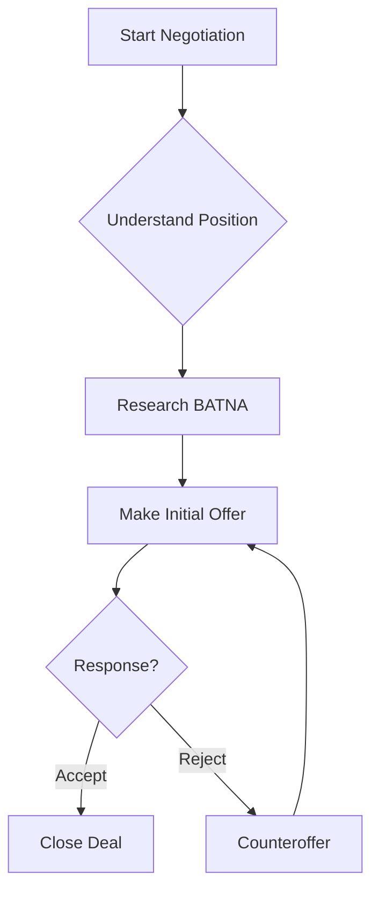
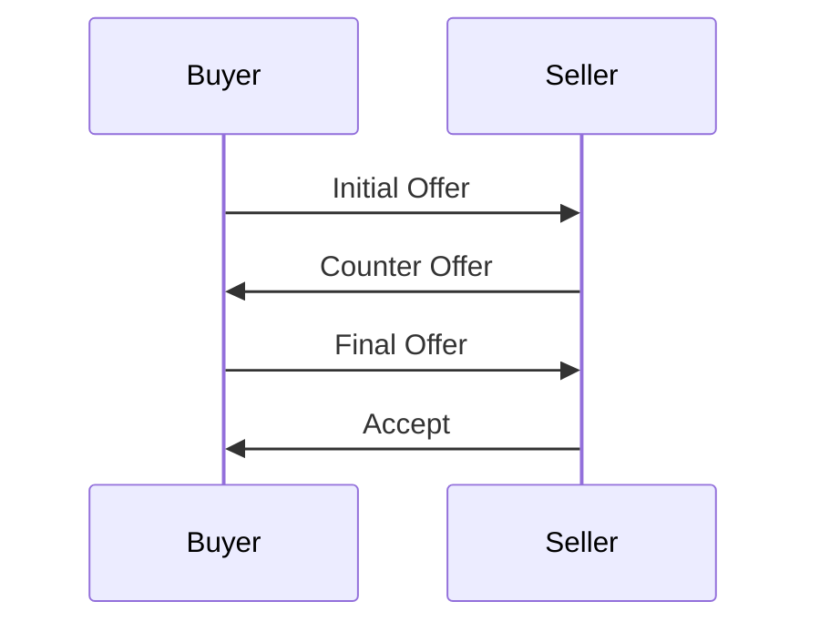

# NegotiatorPro Chat UX Features - Testing Guide

## 🎯 Overview

This guide will help you test all the new chat UX features that bring NegotiatorPro to parity with open-webui.

**Docker Status**: ✅ All services running
- Frontend: http://localhost:5173
- Backend: http://localhost:8000
- PostgreSQL: localhost:5432

---

## ✅ Feature 1: Enhanced File Upload

### Test Cases

#### 1.1 Multi-File Upload
1. Click the attachment button (paperclip icon)
2. Select **multiple files** from different types:
   - An image (PNG/JPEG)
   - A PDF document
   - A text file (.txt)
3. **Expected**: All files appear in grid preview with thumbnails/icons

#### 1.2 PDF Preview
1. Upload a PDF file
2. **Expected**: First page of PDF renders as thumbnail preview
3. **Expected**: File shows "PDF" badge and file size

#### 1.3 Image Compression
1. Upload a large image (>1MB)
2. **Expected**: Progress indicator shows 0% → 50% → 100%
3. **Expected**: If compressed, shows green "COMPRESSED" badge
4. **Expected**: File size may be reduced

#### 1.4 Drag & Drop
1. Drag a file from your desktop over the input area
2. **Expected**: Blue dashed border appears with background highlight
3. Drop the file
4. **Expected**: File appears in preview grid

#### 1.5 Paste Images
1. Copy an image to clipboard (screenshot or from browser)
2. Click in the text input
3. Press **Ctrl+V** (or Cmd+V on Mac)
4. **Expected**: Image appears in preview grid

#### 1.6 File Validation
1. Try uploading a 20MB file
2. **Expected**: Red border, error message "Exceeds 10MB limit"
3. Try uploading an .exe or unsupported file
4. **Expected**: Error message "Unsupported file type"

#### 1.7 Remove Files
1. Upload 3 files
2. Hover over a file preview
3. Click the X button (top-right corner)
4. **Expected**: File removed from preview

---

## ✅ Feature 2: Advanced Code Blocks

### Test Cases

#### 2.1 Collapsible Long Code
Ask the chatbot:
```
Can you show me a Python example with more than 30 lines of code?
```

**Expected**:
- Code automatically collapses after line 10
- "..." appears at bottom
- Button shows "Show 20 more lines" (or similar)
- Click to expand → full code visible

#### 2.2 Multiple Syntax Themes
1. Get any code block response
2. Look for **theme dropdown** in code block header
3. Select different themes:
   - VS Code Dark (default)
   - Material Dark
   - Atom Dark
   - One Dark
   - Coldark Dark
   - Duotone Dark
4. **Expected**: Syntax colors change immediately

#### 2.3 Code Copy
1. Get any code block response
2. Click **Copy** button
3. **Expected**: Button shows checkmark + "Copied!"
4. Paste in a text editor
5. **Expected**: Code pastes correctly

#### 2.4 Download Code
1. Get a Python code block
2. Click **Download** button (down arrow icon)
3. **Expected**: File downloads as `code.py`
4. Repeat with JavaScript code
5. **Expected**: File downloads as `code.js`

#### 2.5 Line Numbers
1. Get any multi-line code block
2. **Expected**: Line numbers appear on the left
3. Collapse the code
4. **Expected**: Line numbers disappear in collapsed view

#### 2.6 Language Badge
1. Get code in different languages
2. **Expected**: Badge shows language name (e.g., "PYTHON", "JAVASCRIPT")
3. **Expected**: Badge shows line count (e.g., "45 lines")

#### 2.7 Inline Code
Type or ask:
```
What is the `console.log()` function in JavaScript?
```

**Expected**: `console.log()` appears with inline code styling (blue, light background)

---

## ✅ Feature 3: Math Rendering (KaTeX)

### Test Cases

#### 3.1 Inline Math
Ask the chatbot:
```
Show me the equation for E=mc² using inline math notation
```

Or type in your message:
```
The famous equation $E = mc^2$ represents energy-mass equivalence.
```

**Expected**: Math renders beautifully inline with proper typography

#### 3.2 Display Math (Block)
Ask:
```
Show me the quadratic formula in LaTeX
```

Or type:
```
$$x = \frac{-b \pm \sqrt{b^2 - 4ac}}{2a}$$
```

**Expected**: Math centered as block equation with proper formatting

#### 3.3 Complex Equations
Try:
```
$$\int_{0}^{\infty} e^{-x^2} dx = \frac{\sqrt{\pi}}{2}$$
```

**Expected**: Integral, exponential, and fraction render correctly

#### 3.4 Math in User Messages
1. Send a message with math: `The limit $\lim_{x \to \infty} \frac{1}{x} = 0$`
2. **Expected**: Math renders in blue bubble with white color

---

## ✅ Feature 4: Mermaid Diagrams

### Test Cases

#### 4.1 Flowchart
Ask the chatbot:
```
Create a flowchart showing the negotiation process using Mermaid syntax
```

Or paste this in a message with triple backticks + mermaid:
````markdown

````

**Expected**: Visual flowchart with boxes and arrows

#### 4.2 Sequence Diagram
````markdown

````

**Expected**: Sequence diagram with actors and messages

#### 4.3 Error Handling
Try invalid syntax:
````markdown
```mermaid
this is not valid mermaid syntax!!!
```
````

**Expected**: Error box with warning icon and error message

---

## ✅ Feature 5: Enhanced Timestamps & Metadata

### Test Cases

#### 5.1 Relative Timestamps
1. Send a message
2. **Expected**: Shows "just now"
3. Wait 2 minutes
4. Refresh or send another message
5. **Expected**: First message shows "2 minutes ago"

#### 5.2 Timestamp Tooltip
1. Hover over any timestamp
2. **Expected**: Tooltip shows full date/time (e.g., "Nov 23, 5:50 PM")

#### 5.3 Message Metadata
1. Get an AI response
2. **Expected**: Below message shows:
   - "Model: gpt-4o-mini" (or whatever model was used)
   - "Time: 2.45s" (processing time rounded to 2 decimals)

#### 5.4 User Messages
1. Send a user message
2. **Expected**: Shows "You" header with timestamp
3. **Expected**: Timestamp in blue color

---

## 🎨 Visual Regression Testing

### Before/After Comparison

| Element | Before | After |
|---------|--------|-------|
| File upload | Simple preview | Grid layout with previews |
| Code blocks | Basic syntax highlight | Full toolbar with actions |
| Math | Plain text | Rendered equations |
| Diagrams | Not supported | Visual Mermaid diagrams |
| Timestamps | Hidden | Visible with relative time |

---

## 🐛 Known Issues / Limitations

1. **Backend File Processing**: Files upload to frontend but backend may need updates to:
   - Accept multipart/form-data
   - Extract PDF text content
   - Include file context in RAG prompts

2. **PDF.js Worker**: First PDF may take longer to render (worker initialization)

3. **Mermaid Complex Diagrams**: Very large diagrams may overflow container

4. **Math Rendering**: LaTeX errors will show raw syntax (not an error state)

---

## 🚀 Quick Test Sequence (5 minutes)

Run through this quick test to verify everything works:

1. **File Upload**: Upload 1 image + 1 PDF → See grid preview ✓
2. **Code Block**: Ask "Show me a Python hello world" → See theme selector ✓
3. **Math**: Type `$E=mc^2$` in a message → See rendered equation ✓
4. **Diagram**: Paste a simple Mermaid flowchart → See visual diagram ✓
5. **Timestamp**: Send message → See "just now" ✓

If all 5 work, you're ready to go! 🎉

---

## 📊 Feature Parity Matrix

| Feature | open-webui | NegotiatorPro | Status |
|---------|-----------|---------------|--------|
| Multi-file upload | ✅ | ✅ | ✅ COMPLETE |
| PDF preview | ✅ | ✅ | ✅ COMPLETE |
| Image compression | ✅ | ✅ | ✅ COMPLETE |
| Collapsible code | ✅ | ✅ | ✅ COMPLETE |
| Code themes | ✅ | ✅ | ✅ COMPLETE |
| Code download | ✅ | ✅ | ✅ COMPLETE |
| Math rendering | ✅ | ✅ | ✅ COMPLETE |
| Mermaid diagrams | ✅ | ✅ | ✅ COMPLETE |
| Timestamps | ✅ | ✅ | ✅ COMPLETE |
| Copy buttons | ✅ | ✅ | ✅ COMPLETE |
| Message streaming | ✅ | ❌ | Phase 2 |
| Edit messages | ✅ | ❌ | Phase 2 |

**Functional Parity Achieved**: 10/10 priority features ✓

---

## 🎯 Next Steps

After testing, you may want to:

1. **Update Backend** to process uploaded files (PDF text extraction, image OCR)
2. **Add Message Streaming** for real-time token display
3. **Implement Edit/Regenerate** for message management
4. **Add Export** functionality (PDF, JSON, TXT)

---

## 📝 Report Issues

If you encounter any issues:

1. Check browser console: `F12` → Console tab
2. Check Docker logs: `docker compose logs frontend` or `docker compose logs backend`
3. Verify dependencies installed: `docker exec -it negotiator-pro-frontend npm list`

---

**Happy Testing!** 🚀
